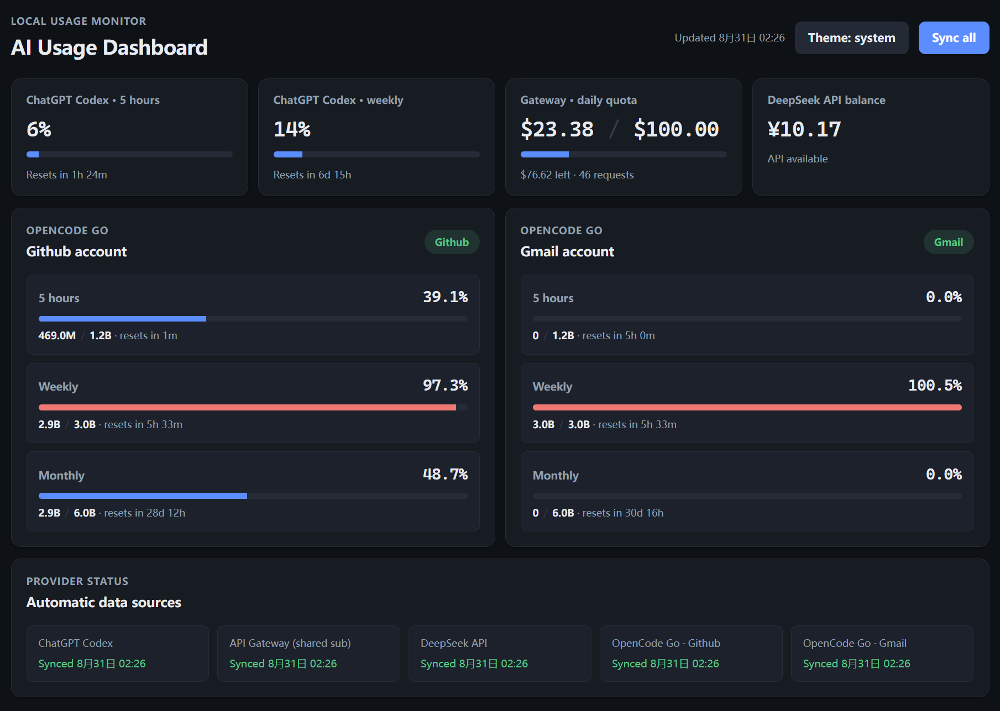

# AI Usage Dashboard

一个本地桌面仪表盘，把散落在多个网页/控制台里的 AI 用量与额度汇总到一个窗口，避免反复登录查看。界面跟随系统深浅色，也可在右上角手动切换 系统 / 浅色 / 深色。



## 支持的数据源

- **ChatGPT Codex** — 5 小时与每周窗口的用量百分比和重置时间。
- **Car360** — 每日 `$100` 限额的已用 / 剩余金额与请求数。
- **DeepSeek API** — 实时账户余额。
- **OpenCode Go** — 多个账号（如 Github、Gmail）各自的 5 小时 / 每周 / 每月用量、Token 与额度。

所有数据由本机应用直接调用官方接口获取，刷新一次或在后台定时同步。

## 启动

```bash
npm install
npm start
```

## OpenCode Go 会话绑定（仅首次）

OpenCode Go 用量页面需要登录态，且一次只能登录一个账号。首次绑定时用 Tabbit 等浏览器登录 opencode.ai 并打开对应 workspace 的 go 页面，取得登录 cookie 后加密导入：

```powershell
# 环境变量指定当前要导入的账号
$env:OPENCODE_GO_IMPORT_LABEL = "github"      # 或 "gmail"
$env:OPENCODE_GO_WORKSPACE_ID = "wrk_xxx"
$env:OPENCODE_GO_COOKIE_FILE = "C:\path\to\cookie.txt"
npm start
```

会话使用 Windows 凭据加密（DPAPI）保存在本机 userData，明文 cookie 导入后立即删除。日常同步不再需要打开浏览器；只有会话过期时才需重新绑定。

## 数据隐私

本项目只在你自己的电脑上运行，不会收集或上传任何数据：

- 所有 API Key 从本机环境变量或本目录下的 `.env` 文件读取（`.env` 已被 gitignore，不会进仓库）。
- 用量数据直接请求官方接口，不经过第三方中转。
- OpenCode Go 登录会话用 Windows 凭据加密后仅保存在本机；明文 Cookie 导入后立即删除。
- 打开源码即可核对：凭据只出现在主进程，不会写入页面存储或任何日志。